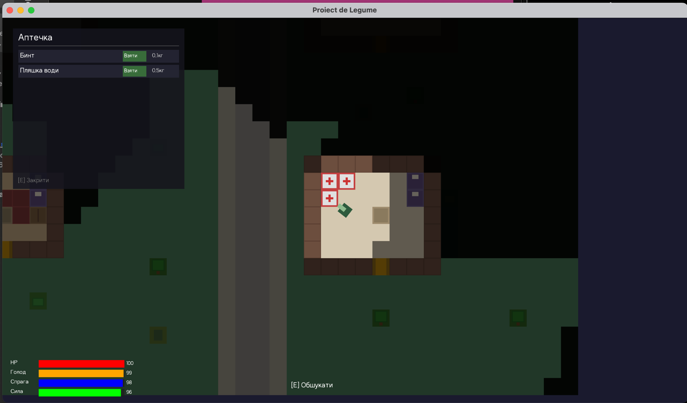

# Proiect de Legume

A 2D top-down survival game inspired by Project Zomboid, built with **C#** and **Godot 4.6.2**.



## Features

- **2D top-down world** — 80x60 tile city with roads, sidewalks, buildings, trees, bushes, benches, and fences
- **Field of View** — 120° vision cone with DDA raycasting; walls block sight, windows don't; fog of war with explored/unknown states
- **Relative movement** — WASD moves relative to where the player is looking (mouse cursor); sprint with Shift
- **Physics collisions** — CharacterBody2D with MoveAndSlide; walls, furniture, and trees block movement
- **16+ buildings** — family homes, cottages, apartments, garages, clinics, shops — each with unique interior
- **Windows** — glass panes in building walls; can see through but can't walk through
- **Lootable containers** — trash cans, kitchen cabinets, wardrobes, medkits, garage shelves — weighted loot tables
- **10 item types** — food, water, bandages, tools, weapons, clothing, junk — loaded from JSON
- **Inventory system** — weight-limited (15kg), item stacking, category color coding
- **Survival stats** — HP, Hunger, Thirst, Fatigue with real-time drain and interconnected effects
- **Consumable items** — eat food (+hunger), drink water (+thirst), use bandages (+HP)
- **Stat effects on gameplay** — low hunger/thirst slows movement; low fatigue blocks sprinting; critical stats reduce FOV
- **HUD** — real-time stat bars with color transitions (green → yellow → red)
- **Camera** — Camera2D with position smoothing
- **Localization** — all texts externalized to JSON; English and Ukrainian included

## Controls

| Key | Action |
|-----|--------|
| **W** | Move forward (toward cursor) |
| **S** | Move backward |
| **A/D** | Strafe left/right |
| **Mouse** | Look direction |
| **Shift** | Sprint (if Fatigue ≥ 40) |
| **E** | Search nearby container |
| **Tab** | Open/close inventory |
| **Esc** | Close panels |

## Tech Stack

| Component | Choice |
|-----------|--------|
| Language | C# |
| Engine | Godot 4.6.2 |
| Serialization | System.Text.Json (built-in) |
| Platform | Desktop (Windows/macOS/Linux) — mobile/web ready |

## Prerequisites

- [.NET SDK 8.0+](https://dotnet.microsoft.com/download/dotnet/8.0)
- [Godot 4.6.2 .NET](https://godotengine.org/download/) — download the **.NET** version (not standard)

> The standard Godot build does NOT support C#. Make sure the filename contains `mono` or `.NET`.

## How to Run

1. Install **.NET SDK 8.0** or later:
   ```bash
   # macOS
   brew install dotnet-sdk
   # or download from https://dotnet.microsoft.com/download/dotnet/8.0
   ```

2. Download **Godot 4.6.2 .NET** from https://godotengine.org/download/
   - macOS: `Godot_v4.6.2-stable_mono_macos.universal.zip`
   - Windows: `Godot_v4.6.2-stable_mono_win64.exe.zip`
   - Linux: `Godot_v4.6.2-stable_mono_linux_x86_64.zip`

3. Open the project:
   - Launch Godot .NET
   - **Import** → select the `proiect_de_legume` folder → **Import & Edit**

4. Build C# code:
   - In the editor, click the **Build** button (hammer icon, top right)
   - Or run `dotnet build` from the project root terminal

5. Run the game:
   - Press **F5** (or ▶ Play button, top right)
   - The game window opens with the city map, player, FOV, and HUD

## Project Structure

```
scripts/
├── GameManager.cs          # Main controller: init, game loop, input
├── player/
│   ├── Player.cs           # CharacterBody2D: movement, collision
│   └── PlayerStats.cs      # HP, Hunger, Thirst, Fatigue
├── world/
│   ├── MapGenerator.cs     # City map generation (80x60)
│   ├── TileSetGenerator.cs # Programmatic tileset image
│   ├── ContainerManager.cs # Lootable container logic
│   └── LootTable.cs        # Weighted random loot
├── inventory/
│   ├── Item.cs             # ItemDef + ItemStack
│   ├── ItemRegistry.cs     # JSON item loader
│   └── Inventory.cs        # Weight-limited inventory
├── fov/
│   └── FieldOfView.cs      # DDA raycasting, fog bitmap
├── localization/
│   └── Lang.cs             # JSON-based i18n
└── ui/
    ├── HUD.cs              # Stat bars, prompts
    ├── InventoryUI.cs      # Inventory panel
    └── ContainerUI.cs      # Container loot panel
```

## Localization

All in-game text is externalized to `assets/data/lang_XX.json`.

Supported languages: **English** (`en`), **Ukrainian** (`uk`)

To switch language, change `Lang.Load("uk")` to `Lang.Load("en")` in `GameManager.cs`.

## Documentation

- [Game Design](docs/GAME_DESIGN.md) — mechanics, tile types, items, controls
- [Roadmap](docs/ROADMAP.md) — completed features and future plans
- [Migration](docs/MIGRATION_GODOT.md) — KorGE → Godot migration details
- [Survival Mechanics](docs/life.md) — detailed survival system design
- [Item Registry](docs/INFO_ITEMS.md) — all items with stats and locations
